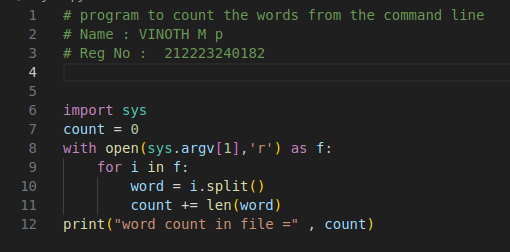

# Command--line-arguments-to-count-word
## AIM:
To write a python program for getting the word count from the contents of a file using command line arguments.
## EQUIPEMENT'S REQUIRED: 
PC
Anaconda - Python 3.7
## ALGORITHM: 
### Step 1:
import sys
### Step 2: 
declare a variable and assign with zero
### Step 3: 
use open() with sys to access the file from the command line
### Step 4:  
now use for loop to access the file
### Step 5: 
within for loop use split() to separate the words
### Step 6: 
now use len() and add the the length of the word to the declared variable
## PROGRAM:
```
# program to count the words from the command line
# Name : VINOTH M p
# Reg No :  212223240182

import sys
count = 0
with open(sys.srgv[i],'r') as f:
    for i in f:
        word = i.split()
        count += len(word)
print("word count in file =" , count)
```
### OUTPUT:



## RESULT:
Thus the program is written to find the word count from the contents of a file using command line arguments.
